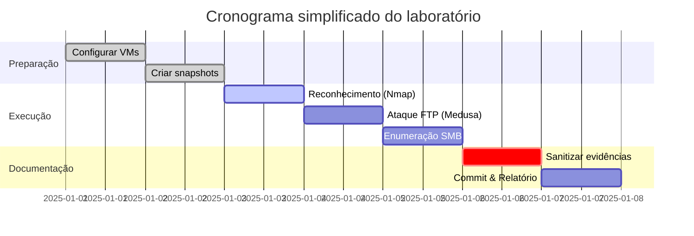

**Desafio DIO — Bootcamp Santander Cibersegurança 2025**

**Santander · Cibersegurança 2025**
**Autor:** LuanGonzaga

🔐 **Projeto: Ataques de Força Bruta com Medusa e Kali Linux (VMware)**
Experimento controlado de força bruta usando **Kali Linux** + **Medusa** contra **Metasploitable2** em VMware Host‑Only (VMnet1). Testes realizados somente em ambiente isolado e autorizado.

---

## Resumo

* **Kali (atacante):** `192.168.52.158`
* **Metasploitable2 (alvo):** `192.168.52.160`
* **Atividades realizadas:**

  1. Reconhecimento (Nmap)
  2. FTP — teste de login anônimo + brute‑force com Medusa (credencial `msfadmin` encontrada; **senha omitida** no repositório)
  3. SMB — enumeração com `enum4linux` (null session permitida) e preparação para password spraying

---

## Estrutura do repositório

```
Simulando_bruteforce_com_medusa/
├─ README.md
├─ commands/ – saídas de ferramentas (nmap, medusa, enum4linux)
├─ evidence/ – evidências e logs (ftp_anon.txt, ftp_msfadmin.txt)
├─ wordlists/ – listas de usuários e senhas (pequenas)
├─ images/ – capturas de tela (nmap, ftp anon, medusa rodando, smb tmp)
└─ .gitignore
```

## Comandos principais (executados e salvos)

> Saídas completas em `commands/`; evidências em `evidence/`; imagens em `images/`.

### Reconhecimento

```bash
nmap -sV -sC 192.168.52.160 -oN commands/nmap_services_192.168.52.160.txt
```

### FTP — anonimato e brute‑force

```bash
# testar login anônimo
curl -v ftp://anonymous@192.168.52.160/ > evidence/ftp_anon.txt 2>&1

# wordlists simples (exemplo)
# wordlists/users_ftp.txt
# wordlists/pass_ftp.txt

# brute-force com Medusa
medusa -h 192.168.52.160 \
  -U wordlists/users_ftp.txt \
  -P wordlists/pass_ftp.txt \
  -M ftp -f -t 6 \
  -O commands/medusa_ftp_output.txt
```

### SMB — enumeração

```bash
enum4linux -a 192.168.52.160 > commands/enum4linux_192.168.52.160.txt 2>&1
# testar share tmp anonimamente
smbclient //192.168.52.160/tmp -N
```

## Resultados e evidências

* **FTP (vsftpd 2.3.4):** login anônimo aceito (`230 Login successful`). Evidência: `evidence/ftp_anon.txt` + `images/02_ftp_anonymous.png`.
* **FTP — brute‑force:** Medusa encontrou credencial para usuário `msfadmin` (senha omitida no repositório). Saída: `commands/medusa_ftp_output.txt`. Validação local em `evidence/ftp_msfadmin.txt` (imagem sanitizada: `images/05_ftp_user_pass_confirm.png`).
* **SMB (Samba 3.0.20‑Debian):** enumeração retornou vários usuários (ex.: msfadmin, ftp, root, www-data, mysql, proftpd, …). Share `tmp` acessível: Listing: OK. Saída: `commands/enum4linux_192.168.52.160.txt`.

**Observação:** senhas e dados sensíveis foram intencionalmente omitidos do repositório para evitar exposição.

## Observações sobre a política de senhas

* Política observada: complexidade desabilitada e sem lockout — favorece ataques de força bruta.

## Análise e recomendações de mitigação

### Problemas observados

* FTP com login anônimo habilitado.
* Conta padrão/fraca detectada (`msfadmin`).
* Samba com null sessions permitidas e política de senha fraca.

### Recomendações

1. **Desabilitar login anônimo no FTP**; migrar para SFTP/FTPS onde possível.
2. **Alterar/remover credenciais padrão**; aplicar política de senhas (mín. 8 caracteres + complexidade).
3. **Habilitar account lockout / rate limiting** após N tentativas falhas.
4. **Restringir permissões nas shares SMB**; desabilitar null sessions.
5. **Atualizar e hardenar serviços** (Samba, vsftpd, Apache, etc.).
6. **Implementar monitoramento e alertas** para tentativas em massa e padrões anômalos de login.

---

## Aviso legal

Este repositório documenta testes de segurança **realizados em ambiente controlado e autorizado**. A reprodução das técnicas descritas em ambientes sem autorização constitui atividade ilegal. Use este material apenas para fins educativos e de defesa.

---

*README gerado automaticamente para o repositório de laboratório.*

## Conteúdo adicional (baseado no repositório)

A seguir há conteúdo expandido e instruções práticas com base nos arquivos e pastas presentes no repositório GitHub.

### Preparação do ambiente (VMware - Host‑Only)

1. **Rede:** configurar as VMs (Kali e Metasploitable2) para `Host-Only (VMnet1)` para manter o ambiente isolado.
2. **Snapshots:** crie snapshots antes de iniciar os testes para permitir rollback rápido.
3. **Recursos:** Kali: 2 vCPU, 4 GB RAM (mínimo); Metasploitable2: 1 vCPU, 1 GB RAM.
4. **Segurança:** assegure que o host não esteja exposto a redes externas e que o experimento esteja autorizado.

### Como reproduzir os testes (passo a passo)

1. Inicialize as VMs e verifique conectividade (ex.: `ping 192.168.52.160`).
2. Reconhecimento:

   ```bash
   nmap -sV -sC 192.168.52.160 -oN commands/nmap_services_192.168.52.160.txt
   ```
3. FTP - teste de anonimato:

   ```bash
   curl -v ftp://anonymous@192.168.52.160/ > evidence/ftp_anon.txt 2>&1
   ```
4. Preparar wordlists:

   * `wordlists/users_ftp.txt` — lista de usernames (ex.: anonymous, ftp, msfadmin)
   * `wordlists/pass_ftp.txt` — lista de senhas (curtas para teste; não incluir credenciais reais)
5. Executar Medusa (FTP):

   ```bash
   medusa -h 192.168.52.160 -U wordlists/users_ftp.txt -P wordlists/pass_ftp.txt -M ftp -f -t 6 -O commands/medusa_ftp_output.txt
   ```
6. SMB — enumeração e acesso a shares:

   ```bash
   enum4linux -a 192.168.52.160 > commands/enum4linux_192.168.52.160.txt 2>&1
   smbclient //192.168.52.160/tmp -N
   ```

### Arquivos de interesse no repositório

* `commands/nmap_services_192.168.52.160.txt` — saída do Nmap com serviços e banners.
* `commands/medusa_ftp_output.txt` — saída do Medusa (resultados de brute‑force).
* `commands/enum4linux_192.168.52.160.txt` — detalhes da enumeração Samba.
* `evidence/ftp_anon.txt` — log do teste de FTP anônimo.
* `evidence/ftp_msfadmin.txt` — validação local da credencial descoberta (senhas removidas).
* `images/` — capturas de tela usadas como evidência (sanitizadas quando necessário).

### Boas práticas ao documentar e publicar evidências

* **Sanitização:** remover ou mascarar senhas e qualquer dado que possibilite acesso real a sistemas.
* **Metadados:** ao exportar imagens (screenshots), limpe metadados EXIF que possam conter caminhos ou usernames.
* **Logs:** mantenha logs completos localmente, mas publique somente versões sanitizadas no repositório.

### Exemplos de comandos úteis (extras)

* Filtrar resultados do Medusa para apresentar apenas credenciais encontradas:

  ```bash
  grep "SUCCESS" commands/medusa_ftp_output.txt || true
  ```
* Checar se o serviço FTP está escutando:

  ```bash
  ss -tlnp | grep ftp || sudo netstat -tlnp | grep :21
  ```

### Mitigação (detalhado)

* **FTP:** desativar `anonymous_enable=YES` em `/etc/vsftpd.conf`; forçar FTPS ou migrar para SFTP (OpenSSH).
* **Política de senhas:** mínimo 8-12 caracteres, mistura de classes de caracteres, bloquear reuse.
* **Lockout:** configurar `pam_tally2`/`faillock` ou soluções de WAF/IDS para bloquear tentativas repetidas.
* **Hardenização Samba:** desabilitar `map to guest` e `null passwords`, limitar `valid users` e usar SMB signing e NTLMv2 apenas.
* **Patching:** atualizar pacotes e aplicar configurações seguras no `/etc` de cada serviço.

### Contribuindo

Se quiser contribuir ao repositório:

1. Fork -> clone -> criar branch (`feature/readme-expansion`).
2. Adicionar entradas em `commands/` e `evidence/` (somente sanitizadas).
3. Submeter um pull request com descrição clara das mudanças.

### Licença e aviso final

* **Licença sugerida:** MIT (incluir `LICENSE` se quiser).
* **Aviso:** todo o conteúdo técnico é para fins educativos. Não execute ataques sem autorização explícita.

---

*Conteúdo adicional gerado automaticamente — baseado no repositório GitHub indicado.*

---

## Visualizações (gráficos)

Para tornar o README mais atrativo, adicionei duas opções de visualização que podem ser exibidas no GitHub:

### 1) Gráfico em Mermaid


